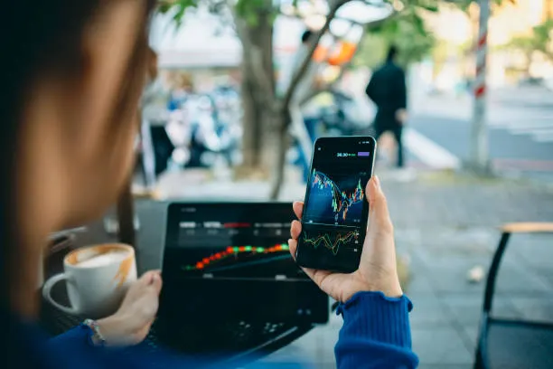

# Test blog 12345

In recent months, the financial world has been buzzing with the unprecedented surge in precious metal prices. Gold and silver, the age-old stores of value, are seeing their valuations climb to historic highs. But what is driving this inflation in value? Is it a bubble waiting to burst, or a reflection of deeper economic shifts?

## The Perfect Storm for Precious Metals

Several factors have converged to create a bullish environment for gold and silver.

### 1. Currency Devaluation and Inflation
As central banks around the world grapple with inflation, the purchasing power of fiat currencies has diminished. Investors traditionally flock to gold and silver as a hedge against inflation. When the value of paper money erodes, real assets like precious metals tend to shine.

### 2. Geopolitical Uncertainty
From conflicts in Eastern Europe to tensions in the Middle East, geopolitical instability drives investors toward "safe-haven" assets. Gold, in particular, has always been the go-to asset during times of crisis.

### 3. Central Bank Buying spree
It's not just retail investors buying gold. Central banks, notably those of China, India, and Turkey, have been accumulating gold reserves at a record pace to diversify away from the US dollar. This massive institutional demand creates a strong floor for prices.

## Gold vs. Silver: The dynamic Duo

While both metals are rising, they behave differently.

*   **Gold** acts primarily as a monetary asset and a store of wealth. Its price is less volatile and is driven more by macroeconomic trends.
*   **Silver** has a dual personality. It is both a monetary metal and an industrial commodity. With the green energy transition increasing demand for silver in solar panels and electronics, silver has a fundamental demand driver that gold lacks.

> "Silver is currently undervalued relative to gold, historically speaking. The gold-to-silver ratio suggests silver has more room to run."

## Is the Value "Inflated"?

The term "inflated" suggests the price is higher than the intrinsic value. However, many analysts argue that these prices are a **re-rating** rather than an inflation.

If we adjust for real inflation (beyond the official CPI numbers), gold's 1980 high would be over $3,000 in today's dollars. By that metric, gold might actually still be cheap.

## The Future Outlook

The trajectory for gold and silver remains positive as long as:
1.  Real interest rates remain low or negative.
2.  Geopolitical tensions persist.
3.  Central banks continue to buy.

However, investors should be wary of short-term corrections. Returns in commodities are rarely linear.

## Conclusion

The rising values of gold and silver are a symptom of the current global economic health. Whether you view them as inflated or simply finding their true value in a depreciating fiat world, they remain a critical component of a diversified portfolio in these turbulent times.
